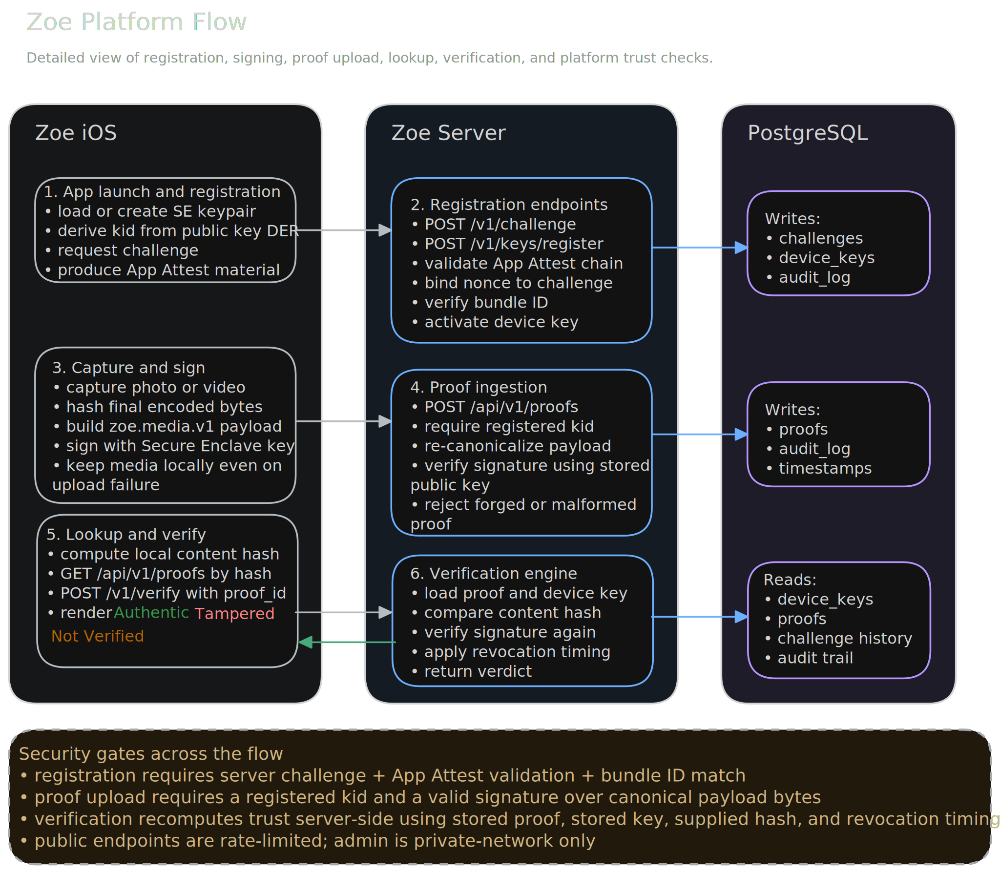

## What is Zoe

Zoe is an open-source attempt to make media trust survive the internet.

Photos and videos don’t stay intact anymore. They get compressed, stripped, edited, and reshared until whatever proof they once had is gone.

Zoe doesn’t try to solve “truth.”  
It solves something narrower and actually achievable:

**Was this file captured on a real device, and has it stayed unchanged since?**

That’s it.

---

## What Zoe tries to fix

Right now, media loses its origin the moment it moves.

A photo might start real, but after a few uploads, screenshots, or edits, there’s no reliable way to trace it back.

Zoe introduces a simple constraint:

- capture media inside a controlled app
- bind it to a hardware-backed identity
- sign the final file at the moment of capture
- keep a verifiable proof that exists independently of the file

No claims about intent.  
No claims about context.  
Just a verifiable origin.

---

## How Zoe works

When you capture media with Zoe:

- a signing key is created inside the Secure Enclave  
- the device is verified using Apple App Attest  
- the file is hashed and signed at capture  
- a detached proof bundle is generated  
- that proof can later be verified against the backend  

This guarantees:

- the media was captured through the Zoe app  
- the file has not been modified since signing  

---

## What Zoe does NOT do (yet)

Zoe does not currently:

- track media across compression or format changes  
- reconnect screenshots or edited versions to the original  
- survive transformations outside exact file matching  

These are active areas of research and development.

---

## Architecture

Zoe is split into two parts:

- [zoe-ios](https://github.com/zoefoundation/zoe-ios)  
  Capture, signing, local library, verification  

- [zoe-backend](https://github.com/zoefoundation/zoe-backend)  
  Device registration, proof storage, verification  

Everything is public and open-source.

---

## Roadmap

- [X] **Protocol specification**  
  Define the core protocol.

- [X] **Build the backend**  
  Built a backend that is able to challenge devices registration to ensure only authorized devices go trough, and store proofs.

- [X] **iOS App** [released in TestFlight, soon App Store] 
  Built an iOS app that is able to receive challenges, use secure enclave to store a certificate, sign proofs and upload the proofs and verify existing contents. It supports also proof check of imported content.

- [X] **JS library for verification** [in-progress] 
  Drafted a basic version of the verification JS Library available for testing on our [website](https://zoe-foundation.com) 
  
- [ ] **Protocol V2 specification**  [in progress] 
  Define the V2 protocol and a basic federation model to decentralize the product and make it resilient conversion/resizing/change of format.

- [ ] **ISCC integration** 
  Add similarity-based fingerprints to handle compression, edits, and re-encoding.

- [ ] **Swift SDK** 
 Extract capture, signing, and proof generation into a reusable library.

- [ ] **V2 Python backend** 
  Provide a self-hostable backend which supports witnesses and multi-hosting for registration, storage, and verification.

- [ ] **Android SDK** 
  Extract capture, signing, and proof generation into a reusable library (only for Android devices with hardware signing).

- [ ] **JavaScript verification library** 
  Verify media content against a proof registry. Easy to integrate for web apps.

- [ ] **C2PA integration** 
  Extended support for C2PA content credentials.

---

## Audits

Before marking a library/SDK as safe to use, we will perform a 3rd party audit to ensure code safety, protocol integrity and adherence to modern programming standards.

---

## Current direction

Zoe is an early prototype.

The focus right now is not scale or hype, but correctness:

- minimal claims  
- verifiable guarantees  
- clear trust boundaries  
